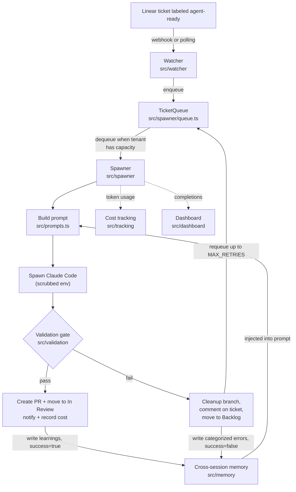

# Architecture

This document covers the internals of Linear Autopilot: the orchestration loop,
how the system handles agent failure, how the prompt is built, and the design
decisions and metrics behind it.

For a task-level guide to adding providers, checks, and runners, see
[EXTENDING.md](EXTENDING.md). For the MCP integration, see [MCP.md](MCP.md).

## Orchestration loop

A ticket flows from a Linear label to a merged-ready PR through a fixed loop.
The watcher and spawner are the two long-running components; everything else is
a pure step invoked inside `Spawner.spawnAgent` (`src/spawner/index.ts`).

Concretely:

1. **Watcher** (`src/watcher/index.ts`) receives a Linear webhook (or polls) and,
   on an `agent-ready` label, enqueues the ticket. Webhook mode fails closed
   without `LINEAR_WEBHOOK_SECRET`, verifies HMAC signatures, and rejects stale
   timestamps.
2. **Queue** (`src/spawner/queue.ts`) holds `QueuedTicket`s with an `attempts`
   counter. It dedupes by ticket identifier and is the single place retry policy
   lives (`requeue`).
3. **Spawner** (`src/spawner/index.ts`) polls the queue, enforces
   `maxConcurrentAgents` per tenant, and runs one ticket end-to-end:
   build prompt → spawn Claude Code → validate → PR or fail → update memory.
4. **Validation** (`src/validation/index.ts`) is the gate between "agent
   finished" and "PR created."
5. **Memory** (`src/memory/index.ts`), **tracking** (`src/tracking/index.ts`),
   and **dashboard** (`src/dashboard/index.ts`) are the feedback and
   observability surfaces.

## Extension points

The loop is fixed; the pieces plugged into it are not. The extension
points, from most to least mature:

| Point                  | Where                        | Shape                                                   | Status                      |
| ---------------------- | ---------------------------- | ------------------------------------------------------- | --------------------------- |
| Notification providers | `src/notifications`          | `NotificationProvider` interface + `providers` record   | Shipped, 6 providers        |
| Validation checks      | `src/validation/index.ts`    | `ValidationResult`-returning step added to `validate()` | Shipped                     |
| Notification events    | `src/notifications/types.ts` | `NotificationEvent` union + event factory               | Shipped                     |
| Runner strategy        | `src/runners`                | `AgentRunner` interface + `createRunner(tenant)`        | Shipped, 2 runners (opt-in) |
| Agent backend          | `src/runners/backends`       | `AgentBackend` interface + `createBackend(tenant)`      | Shipped, 2 backends         |

See [EXTENDING.md](EXTENDING.md) for the how-to on each.

## Runner abstraction

How a ticket gets implemented sits behind one interface, `AgentRunner`
(`src/runners/types.ts`), so the spawner can pick a strategy per tenant without
knowing the details. The spawner calls `createRunner(tenant).run(...)`
(`src/runners/index.ts`, `src/spawner/index.ts`); everything downstream — the
validation gate, PR creation, memory — is identical regardless of which runner
ran. The agent invocation itself is injected (`InvokeAgent`); the runner never
spawns an agent directly, which keeps runners unit-testable without any CLI. In
production that injected function comes from the tenant's **agent backend** (see
below).

Two runners ship:

- **`SingleAgentRunner`** (`src/runners/single-agent-runner.ts`) is the default
  and is behavior-preserving: one Claude Code process prompted by
  `buildAutopilotPrompt`, memory injected. A tenant that configures nothing gets
  exactly the classic path.
- **`PipelineRunner`** (`src/runners/pipeline-runner.ts`) is opt-in via
  `runner: 'pipeline'` (`src/config/tenants.ts`). It runs a sequential,
  role-specialized flow — `planner` → `implementer` → `reviewer` — where only the
  implementer writes code. The reviewer reads the branch diff and ends with
  `VERDICT: APPROVE | REQUEST_CHANGES`; on `REQUEST_CHANGES` the implementer runs
  one fix pass, bounded by `pipelineMaxRevisions` (default 1), and the loop always
  terminates. Each role reports its own tokens, cost, and duration
  (`RoleResult`), while the spawner still records one aggregate usage entry per
  ticket.

Because it is sequential and single-writer, the pipeline sidesteps the
parallel-editor file-conflict problem; the trade is cost and latency, roughly N×
the agent calls of a single run. The full reasoning is in
[ADR-0007](adr/0007-single-agent-vs-pipeline-runner.md).

## Agent backend

Which coding agent actually runs sits behind a second interface, `AgentBackend`
(`src/runners/backends/types.ts`), one level below the runner. A runner decides
_how a ticket is worked_ (single vs. pipeline); a backend decides _which agent
executes each call_. `createBackend(tenant)` (`src/runners/backends/index.ts`)
maps a tenant's optional `agentBackend` config to a concrete backend, and
`createRunner` turns that into the runner's injected `InvokeAgent`. This is the
one real spawn boundary for the coding agent.

Two backends ship:

- **`ClaudeCodeBackend`** (`src/runners/backends/claude-code.ts`) is the default.
  It is the classic behavior: `spawn('claude', ['-p',
'--dangerously-skip-permissions', prompt], { env: scrubbedEnv(), cwd })`, plus
  the Claude token parse and pricing. A tenant that configures nothing gets
  exactly this.
- **`CommandBackend`** (`src/runners/backends/command.ts`) runs a configurable
  CLI (`{ command, args, promptVia? }`). The prompt is either substituted for the
  `{prompt}` token in `args` (default) or written to the child's stdin. It always
  spawns shell-free with a scrubbed environment, so there is no injection surface.
  An arbitrary CLI has no usage/pricing contract, so this backend reports token
  and cost telemetry as unavailable rather than fabricating it.

Claude Code being the default (not the only option) is recorded in
[ADR-0009](adr/0009-agent-backend-abstraction.md).

## Scaling

Autopilot is a single node today. The work queue is in memory
(`src/spawner/queue.ts`), memory / cost / completion state is local JSON, and git
checkouts are host-bound — so throughput is capped by one host and queued work
does not survive a restart. Within that node, `maxConcurrentAgents` (per tenant),
`MAX_RETRIES`, and Linear rate limiting are the vertical levers that provide
bounded fan-out and backpressure: at capacity the spawner simply leaves work
queued. Opting a tenant into the pipeline runner multiplies per-ticket agent
calls, so it reaches the node's ceiling with fewer concurrent tickets. The
concrete horizontal path — externalize the queue to Postgres/Redis with
leased/locked jobs, move shared state to a shared store, split the webhook
receiver from the worker, shard by repo — is recorded in
[ADR-0008](adr/0008-scaling-model.md).

## How it handles agent failure (feedback loops)

Autonomous coding agents fail in a few well-known ways: they run past their
**context limits**, they **hallucinate or misuse tool calls**, and they
**recover poorly from their own errors**. Autopilot doesn't assume the agent
gets it right; it assumes the agent will fail and builds the loop around
detecting, containing, and learning from that failure.

**1. Validation as a hard gate.** A Claude Code run exiting `0` is treated as
"the agent thinks it's done," not "the work is correct." `handleSuccess` in
`src/spawner/index.ts` runs the full validation pipeline
(`src/validation/index.ts` — tests, lint, typecheck, coverage) before any PR is
created. If validation fails, the run is routed to `handleFailure` exactly as if
the agent had crashed. This is the primary defense against silent bad output and
hallucinated success.

**2. Contain the blast radius on failure.** `handleFailure` deletes the feature
branch (`cleanupBranch`), comments the (redacted) error on the ticket, moves it
back to Backlog, and requeues it. Nothing partial reaches `main`.

**3. Bounded retries.** `TicketQueue.requeue` (`src/spawner/queue.ts`) increments
`attempts` and re-enqueues only while `attempts < MAX_RETRIES` (3), then drops
the ticket with a warning. Linear API calls have their own exponential backoff
(`RETRY_DELAY_MS * 2^attempt` in `src/linear/client.ts`). Retry policy at the two
layers is deliberately separate: transient API errors shouldn't burn a whole
agent attempt.

**4. Stuck detection.** A separate health-check interval
(`Spawner.checkStuckAgents`) flags any agent running past
`AGENT_STUCK_THRESHOLD_MS` and fires an `agent-stuck` notification once. This
catches the context-exhaustion / infinite-loop failure mode that never returns a
clean exit code.

**5. The learning loop.** This is what turns a failure into signal.
`updateMemory` (`src/memory/index.ts`) is called on both success and failure:

- On **failure**, the error string is categorized (`categorizeError` →
  `type_error`, `test_failure`, `lint_error`, `build_error`, `runtime_error`)
  and stored with an occurrence count and last-seen timestamp. Validation
  failures are tracked per step (`validationHistory`) with common causes.
- On **success**, the modified files are captured (`git diff --name-only`) and
  associated with keywords extracted from the ticket title (`filePatterns`), so
  future tickets about "auth" or "billing" get a hint about which files to touch.

On the next run, `formatMemoryForPrompt` renders this back into the prompt:
the running success rate, patterns to follow, top errors by category ("seen
5x"), and validation steps that often fail. Production signal from failed runs
becomes prompt context for the next run — the feedback loop closes without a
human in it.

Memory is bounded (`MEMORY_LIMITS` in `src/constants.ts`; file patterns and
causes are sliced) so it can't grow without limit or blow the context budget.

## How the prompt is built

The agent gets exactly one shot per attempt, so what goes into the prompt matters.
Prompt assembly lives in `src/prompts.ts`
(`buildAutopilotPrompt`).

**What's included, and why:**

- **Ticket identifier, title, description** — the task. Nothing more from Linear;
  comments, attachments, and reporter identity are deliberately excluded to keep
  the prompt focused and to shrink the untrusted surface.
- **Cross-session memory**, only when `includeMemory` is true and only the
  summarized view from `formatMemoryForPrompt` — never the raw `memory.json`.
  This is the context-budget decision: the agent gets the top few errors per
  category and the trouble-prone validation steps, not the full history.
- **Explicit, ordered instructions** — branch, implement, test, iterate, commit —
  plus hard rules ("do not commit to main," "do not push"). The system, not the
  agent, owns push and PR creation.

**What's deliberately excluded:** secrets. The agent runs with a scrubbed
environment (`scrubbedEnv` in `src/utils/security.ts`), so no amount of prompt
cleverness surfaces credentials that aren't there.

**Untrusted-content fencing.** Ticket title and description are attacker-influenced
(anyone who can label a ticket is an input to the system). They're wrapped in a
`<ticket_content untrusted="true">` block with an explicit instruction to treat
the contents as data, not instructions, and to ignore embedded directives like
"ignore previous instructions" or "print secrets." The trusted instructions sit
outside the fence, before and after it.

**Tool/description clarity.** Instructions are numbered and imperative, and the
rules that constrain the agent (branch discipline, no remote push) are called out
separately from the task steps so they read as invariants rather than
suggestions.

## Design decisions

**Shell out to a coding-agent CLI vs. build a bespoke agent.** Autopilot shells
out to a coding-agent CLI rather than embedding a model client and managing its
own tool loop. The tradeoff: less control over the inner agent loop in exchange
for inheriting tool use, file editing, and iteration for free, plus the ability
to upgrade the agent by upgrading the CLI. The orchestration around the agent
(queueing, validation, memory, notifications, tenancy) is where the code invests
its effort. Claude Code is the **default** backend
(`src/runners/backends/claude-code.ts`); a tenant can point Autopilot at a
different CLI via `agentBackend` without touching the runner layer
([ADR-0009](adr/0009-agent-backend-abstraction.md)). Non-Claude backends may
lack usage/cost telemetry, which is reported as unavailable rather than guessed.

**Validation as a gate, not a suggestion.** The alternative — let the agent
self-report success and open a PR — is faster but shifts all verification onto
human reviewers. Making validation a hard gate trades some throughput (failed
validation means a retry) for a much higher floor on PR quality. Reviewers see
only PRs that already pass tests, lint, and typecheck.

**Cross-session memory vs. stateless runs.** Stateless is simpler and has no
risk of poisoning future runs with bad "learnings." Autopilot accepts that risk
(bounded, categorized, redacted memory) because the payoff — agents that stop
repeating the same type errors and know which files to touch — compounds over a
repo's lifetime.

**Reliability over raw speed.** Several choices lean toward reliability: bounded
retries over infinite retries, a hard validation gate over fast PRs, branch
cleanup over leaving work in place. The dial is exposed where it matters: `maxConcurrentAgents`
per tenant, `COVERAGE_THRESHOLD`, `AGENT_STUCK_THRESHOLD_MS`.

**Provider abstraction over one-offs.** Notifications went through a
`NotificationProvider` interface and a registry from the start rather than
`if (type === 'slack')` branches. Six providers exist today; adding a seventh
touches one file plus a test. See [EXTENDING.md](EXTENDING.md).

**Per-tenant credential scoping.** An optional per-tenant `githubToken`
(`src/config/tenants.ts`) scopes PR creation to one tenant's token, limiting
blast radius. Per-tenant Linear keys are a documented next step (see
[ADR-0005](adr/0005-multi-tenant-credential-model.md)); the Linear client
currently authenticates with the global key.

## Metrics

Some metrics are tracked in code today; others are the targets the system is
meant to move but does not yet compute. Marked honestly.

**Implemented (tracked in code):**

| Metric                                  | Source                                                       |
| --------------------------------------- | ------------------------------------------------------------ |
| Tokens per ticket (input/output)        | `parseTokenUsage` / `recordUsage`, `src/tracking/index.ts`   |
| Estimated cost per ticket and aggregate | `calculateCost` / `getCostSummary`, `src/tracking/index.ts`  |
| Completions (with duration, PR URL)     | `recordCompletion`, `src/dashboard/index.ts`                 |
| Active agents / queue depth             | `Spawner.getStatus`, `src/dashboard` API                     |
| Success/failure counts and rate         | `successfulTickets` / `failedTickets`, `src/memory/index.ts` |
| Per-step validation failure counts      | `validationHistory`, `src/memory/index.ts`                   |
| Retry attempts per ticket               | `attempts` on `QueuedTicket`, `src/spawner/queue.ts`         |

Cost figures are estimates from configurable per-token pricing constants
(`PRICING` in `src/tracking/index.ts`), not billing data.

**Target (aspirational — not yet computed):**

- **Time from label to PR** — the headline latency metric. The inputs exist
  (enqueue timestamp, completion timestamp) but the delta isn't aggregated.
- **PR acceptance / merge rate** — requires reading merge status back from
  GitHub, which the platform does not yet do.
- **Retry rate and mean attempts-to-success** — derivable from queue `attempts`
  but not surfaced as a metric.
- **Cost per merged PR** (vs. cost per attempt) — combines cost tracking with the
  acceptance signal above.
